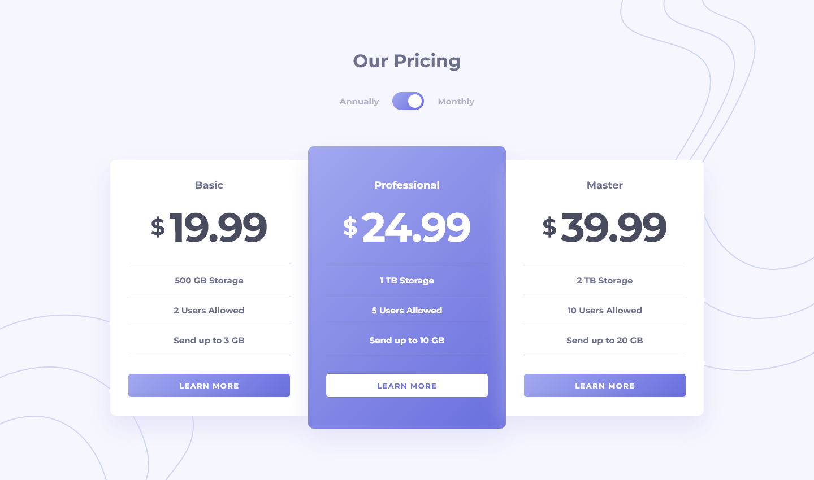

# Frontend Mentor - Pricing component with toggle solution

This is a solution to the [Pricing component with toggle challenge on Frontend Mentor](https://www.frontendmentor.io/challenges/pricing-component-with-toggle-8vPwRMIC). Frontend Mentor challenges help you improve your coding skills by building realistic projects.

### Screenshot

### Links

- Solution URL: [Solution URL here](https://github.com/NDK1195/pricing-component-with-toggle)
- Live Site URL: [Live site URL here](https://pricing-component-with-toggle-dusky-rho.vercel.app/)

### Built with

- HTML5
- Tailwind CSS
- React
